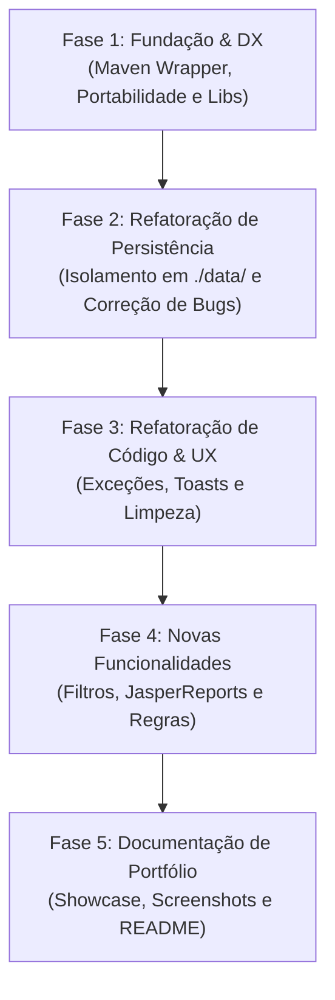

# 🗺️ Planejamento Estratégico de Evolução • PharmaStation

Este documento estabelece o roadmap de evolução e profissionalização do projeto **PharmaStation**. 

Ele foi desenhado com base nos princípios de **Fundação Sólida, Modificabilidade e Separação de Preocupações** (estudados no *Curso.dev*), separando estritamente:
1. **Fundação e Estrutura (DX)**: Infraestrutura, empacotamento e portabilidade.
2. **Refatoração de Código**: Melhoria interna e estabilidade sem alterar comportamento externo.
3. **Novas Funcionalidades**: Mudanças de negócio e expansões.
4. **Apresentação e Portfólio**: Documentação de alto impacto para o GitHub.

---

## 🏛️ Filosofia das Fases (Inspirada no Curso.dev)

* **Princípio da Modificabilidade:** Cada alteração deve tornar as próximas alterações mais fáceis, nunca mais difíceis.
* **Isolamento de Escopo:** Não misturamos mudanças de infraestrutura/build com refatoração de código Java ou novas regras de negócio.
* **Controle Granular:** Nenhuma classe de domínio ou persistência é alterada sem revisão prévia e validação isolada.
* **Idempotência do Ambiente:** Rodar a aplicação não deve deixar arquivos "sujos" ou rastreados no Git.

---

## 🧭 Visão Geral do Roadmap



---

## 📦 FASE 1: Fundação & DX (Developer Experience)
> **Objetivo:** Fazer o projeto ser clonado e executado em **qualquer computador** (Windows, Linux ou macOS) com um único comando, sem depender do NetBeans ou de configurações manuais de variáveis de ambiente.

### O que entra nesta fase:
1. **Maven Wrapper Oficial (`mvnw` e `mvnw.cmd`):**
   * Adição dos scripts e da pasta `.mvn/wrapper/`.
   * Permite rodar builds consistentes sem exigir que a máquina tenha o Maven instalado no sistema.
2. **Resolução Portátil das Bibliotecas Raven (`library/`):**
   * Configuração das 3 dependências (`modal-dialog`, `swing-glasspane-popup`, `swing-toast-notifications`) utilizando escopo de sistema com `${project.basedir}`:
     ```xml
     <dependency>
         <groupId>raven.popup</groupId>
         <artifactId>swing-glasspane-popup</artifactId>
         <version>1.5.1</version>
         <scope>system</scope>
         <systemPath>${project.basedir}/library/swing-glasspane-popup-1.5.1.jar</systemPath>
     </dependency>
     ```
   * Elimina a necessidade da execução prévia de `mvn install` ou de configurações estranhas no `pom.xml`.
3. **Scripts de Inicialização Portáteis:**
   * Ajuste do `iniciar.bat` (Windows) e criação do `iniciar.sh` (Linux/macOS) usando caminhos relativos para executar o projeto de forma limpa na área de trabalho do usuário.
4. **Saneamento do `.gitignore`:**
   * Garantir que pastas de artefatos (`target/`, logs temporários) estejam blindadas.

> [!NOTE]
> **Regra da Fase 1:** Nenhuma linha de lógica Java ou classe de negócio (`br.edu.ifs.farmacia.*`) é alterada nesta fase. Foco 100% em infraestrutura e build.

---

## 💾 FASE 2: Saneamento da Persistência de Dados
> **Objetivo:** Isolar o salvamento de dados para que a execução da aplicação não modifique arquivos do código-fonte e corrigir fragilidades de serialização.

### O que entra nesta fase:
1. **Criação do Diretório de Dados Isolado (`./data/`):**
   * Alterar `UsuarioDataManager`, `ProdutoDataManager` e `VendaDataManager` para salvar dados em `./data/*.dat` relativo à pasta de execução.
   * Os arquivos originais em `src/main/resources/serialized_objects/` passam a atuar exclusivamente como **seed inicial** (copiados na primeira execução caso a pasta `./data/` esteja vazia).
   * Adicionar `data/` ao `.gitignore` — fim do problema de arquivos modificados sem você mexer!
2. **Eliminação do Risco de Recursão Infinita (`StackOverflowError`):**
   * Revisão cirúrgica dos métodos `carregar()` nos 3 DataManagers: caso o arquivo `.dat` esteja corrompido ou ausente, instanciar um repositório limpo (`new XxxRepository()`) em vez de chamar recursivamente `XxxRepository.getInstance()`.
3. **Revisão e Aprovação:**
   * Cada arquivo modificado será exibido em diff claro para validação antes do commit.

---

---

## 🧹 FASE 3: Refatoração de Código, Qualidade Técnica & UX
> **Objetivo:** Eliminar todos os warnings do compilador e linter, aperfeiçoar o Type Safety das estruturas de dados de ED1, remover código morto, modernizar o feedback visual e, com a base 100% limpa e validada, atualizar dependências para suas versões oficiais.

### O que entra nesta fase:

1. **Saneamento de Warnings e Type Safety nas Estruturas de Dados (ED1):**
   * **`No<E>`:** Parametrizar nós referenciados (`No<E> proximo`) e eliminar raw types nos construtores.
   * **`Lista<E>`:** Parametrizar instâncias e variáveis locais (`No<E> atual`), eliminando conversões não checadas (`unchecked conversions`).
   * **`Fila<E>`:** Corrigir instanciação genérica de nós (`new No<>(elemento)`), eliminar raw types e remover método morto `add(E)` que duplica `enfileirar(E)`.
   * **`ButtonClickListener`:** Adicionar anotação `@SafeVarargs` para parâmetros varargs genéricos (`E... source`).
   * **Objetivo:** Obter compilação limpa sem avisos em `mvnw clean compile -Xlint:unchecked`.

2. **Eliminação de Redundâncias e Declarações Supérfluas:**
   * **`Administrador` e `Funcionario`:** Remover `implements Serializable` explícito, pois já herdam `Serializable` de `Usuario`.
   * **`TipoUsuario`:** Remover `implements Serializable` explícito, pois todo `enum` já estende nativamente `Enum<T>` (que implementa `Serializable`).

3. **Eliminação de Imports Mortos e Código Não Utilizado (Dead Code):**
   * Limpeza de imports descartados em `VendaRepository.java`, `PanelLogin.java`, `PanelProdutos.java` e `LoginForm.java`.
   * Remoção de variáveis e campos de formulário órfãos (ex: `buttonGroup1` em `PanelVenda.java`).
   * Limpeza de comentários residuais de `// TODO add your handling code here`.

4. **Parametrização e Tipagem na Camada de Visão (UI):**
   * Ajustar tipagem genérica em tabelas (`Class<?>[]` no `PanelProdutos.java`).
   * Parametrizar listas na UI (`Lista<Venda> vendidos = new Lista<>()`).

5. **Substituição de `JOptionPane` por Toasts Visuais:**
   * Trocar diálogos modais intrusivos por notificações flutuantes fluidas com a biblioteca `swing-toast-notifications`.

6. **Tratamento de Exceções Customizadas:**
   * Padronizar o fluxo das exceções de negócio (`ProdutoJaExisteException`, `ProdutoNaoEncontradoException`, `VendaNaoEncontradaException`).

7. **Atualização Segura de Dependências (Raven Modal-Dialog 2.6.2 do Maven Central):**
   * **Pré-requisito Rígido:** Só executar este upgrade **DEPOIS** que toda a refatoração e limpeza dos itens 1 a 6 estiverem 100% concluídas e aprovadas com `make check`.
   * Migrar de `raven.modaldialog:modal-dialog:1.1.0` (local) para `io.github.dj-raven:modal-dialog:2.6.2` (Maven Central oficial), adaptando as chamadas de API necessárias no `MainForm.java`.
   * Revalidar integralmente com `make check`.

---

## 🚀 FASE 4: Novas Funcionalidades, Identidade Visual & Gestão
> **Objetivo:** Adicionar melhorias práticas no fluxo da farmácia, unificação da identidade visual e modernização de experiência do usuário.

### 4.1. Conquistas Recentes (Concluídas e Validadas):
* [x] **Identidade Visual Teal (`#0B949E`):** Paleta institucional unificada no FlatLaf, botões semânticos e gradiente moderno no painel deslizante.
* [x] **Renderização de Alta Fidelidade com HiDPI:** Algoritmo progressivo multi-step bicúbico com `BaseMultiResolutionImage` para nitidez máxima do logo em qualquer DPI do Windows.
* [x] **Filtros e Buscas Dinâmicas:** Busca reativa em tempo real com `DocumentListener` no Estoque e no PDV.
* [x] **Alertas de Estoque Baixo:** Realce visual automático em vermelho (`#D9534F`) em negrito com tooltips para produtos com quantidade $\le 5$ unidades.
* [x] **Padronização Monetária Brasileira:** Formatação universal em `R$ #,##0.00` em toda a interface e relatórios.
* [x] **Exclusão Segura com Modal:** Botão "Excluir" com confirmação via `ModalDialog` e persistência imediata.

### 4.2. Conquistas Concluídas e Validadas (Sprint Atual):
* [x] **Modo Dark Padrão:** O sistema inicia diretamente no `FlatMacDarkLaf`, mantendo sincronização com o botão switch para alternância sob demanda.
* [x] **Módulo Completo de Gestão de Usuários (RBAC / Apenas Admin):**
  * `UsuarioController` implementado com validações de segurança e regras de negócio.
  * Expansão de `UsuarioRepository` com métodos `remover()`, `atualizar()` e `buscarPorUsername()` com persistência automática.
  * Criação do painel visual `PanelUsuarios` com listagem moderna em tabela FlatLaf, badges para os perfis (`Administrador` / `Funcionário`) e busca reativa instantânea.
  * Modal moderno de cadastro e edição de usuários (`PanelCreateUsuario`).
  * **Regra Estrita de Segurança:** Acesso concedido exclusivamente para usuários com perfil de `Administrador`.
* [x] **Apresentação Institucional Refinada ("Saiba Mais"):**
  * Texto corporativo moderno no painel de informações do login destacando os 4 pilares: Controle de Estoque, PDV, Gestão de Acessos e Alta Confiabilidade.
* [x] **Reorganização de Navegação no `MainForm`:**
  * Navegação moderna por abas com FlatLaf styling (`tabType:underlined`), cabeçalho superior com dados da sessão ativa, identificação visual do usuário e botão de encerramento de sessão (Logout).
  * Exibição condicional da aba de Usuários estritamente para Administradores.
* [x] **Modernização Visual do JasperReports 7.0:**
  * Redesenho dos modelos `estoque.jrxml` e `vendas.jrxml` na paleta Teal (`#0B949E`), cabeçalhos com títulos acentuados em caixa alta e data/hora dinâmica de emissão.
  * Logotipo oficial nítido no cabeçalho e marca d'água elegante com transparência suave (8%) renderizada no `<background>` da página.
  * Resolução dinâmica de classpath no `ReportManager` garantindo compilação em tempo de execução sem falhas.

---

## 🌟 FASE 5: Documentação & Portfólio (Showcase)
> **Objetivo:** Transformar o PharmaStation em um projeto vitrine no GitHub pronto para screenshots.

### O que entra nesta fase:
1. [x] **Capturas de Tela (Screenshots) de Alta Resolução:**
   * Login elegante em Dark Mode (`assets/login.png`).
   * Painel institucional de boas-vindas ("Saiba Mais") (`assets/saiba-mais.png`).
   * Catálogo de Estoque com filtros e realce de estoque (`assets/estoque.png`).
   * Módulo de Gestão de Usuários e RBAC (`assets/gestao-user.png`).
   * Relatórios JasperReports em PDF com cabeçalho e marca d'água (`assets/report-estoque.png` e `assets/report-venda.png`).
2. [x] **README.md Premium:**
   * Galeria visual em cards/tabelas com screenshots do sistema em alta resolução.
   * Documentação detalhada dos novos recursos (RBAC, JasperReports 7.0, Dark Mode).
   * Badges, arquitetura e instruções rápidas de 1 clique.
3. [ ] **Release Oficial no GitHub (v1.1.0):**
   * Disparo da esteira automatizada de CI/CD para distribuição dos binários (`PharmaStation.exe` e `pharmastation.jar`).

---

## 🛡️ Protocolo de Validação Contínua (Regra de Ouro)
> Sempre que uma tarefa for realizada ou antes de qualquer commit/conclusão de fase, **SEMPRE** execute:
> ```bash
> make check
> ```
> O comando garante a tripla validação: (1) compilação limpa do zero, (2) execução de testes, e (3) empacotamento integral do Fat JAR.

