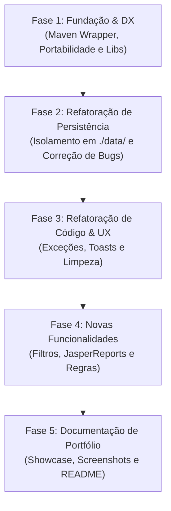

# 🗺️ Planejamento Estratégico de Evolução • PharmaStation

Este documento estabelece o roadmap de evolução e profissionalização do projeto **PharmaStation**. 

Ele foi desenhado com base nos princípios de **Fundação Sólida, Modificabilidade e Separação de Preocupações** (estudados no *Curso.dev*), separando estritamente:
1. **Fundação e Estrutura (DX)**: Infraestrutura, empacotamento e portabilidade.
2. **Refatoração de Código**: Melhoria interna e estabilidade sem alterar comportamento externo.
3. **Novas Funcionalidades**: Mudanças de negócio e expansões.
4. **Apresentação e Portfólio**: Documentação de alto impacto para o GitHub.

---

## 🏛️ Filosofia das Fases (Inspirada no Curso.dev)

* **Princípio da Modificabilidade:** Cada alteração deve tornar as próximas alterações mais fáceis, nunca mais difíceis.
* **Isolamento de Escopo:** Não misturamos mudanças de infraestrutura/build com refatoração de código Java ou novas regras de negócio.
* **Controle Granular:** Nenhuma classe de domínio ou persistência é alterada sem revisão prévia e validação isolada.
* **Idempotência do Ambiente:** Rodar a aplicação não deve deixar arquivos "sujos" ou rastreados no Git.

---

## 🧭 Visão Geral do Roadmap



---

## 📦 FASE 1: Fundação & DX (Developer Experience)
> **Objetivo:** Fazer o projeto ser clonado e executado em **qualquer computador** (Windows, Linux ou macOS) com um único comando, sem depender do NetBeans ou de configurações manuais de variáveis de ambiente.

### O que entra nesta fase:
1. **Maven Wrapper Oficial (`mvnw` e `mvnw.cmd`):**
   * Adição dos scripts e da pasta `.mvn/wrapper/`.
   * Permite rodar builds consistentes sem exigir que a máquina tenha o Maven instalado no sistema.
2. **Resolução Portátil das Bibliotecas Raven (`library/`):**
   * Configuração das 3 dependências (`modal-dialog`, `swing-glasspane-popup`, `swing-toast-notifications`) utilizando escopo de sistema com `${project.basedir}`:
     ```xml
     <dependency>
         <groupId>raven.popup</groupId>
         <artifactId>swing-glasspane-popup</artifactId>
         <version>1.5.1</version>
         <scope>system</scope>
         <systemPath>${project.basedir}/library/swing-glasspane-popup-1.5.1.jar</systemPath>
     </dependency>
     ```
   * Elimina a necessidade da execução prévia de `mvn install` ou de configurações estranhas no `pom.xml`.
3. **Scripts de Inicialização Portáteis:**
   * Ajuste do `iniciar.bat` (Windows) e criação do `iniciar.sh` (Linux/macOS) usando caminhos relativos para executar o projeto de forma limpa na área de trabalho do usuário.
4. **Saneamento do `.gitignore`:**
   * Garantir que pastas de artefatos (`target/`, logs temporários) estejam blindadas.

> [!NOTE]
> **Regra da Fase 1:** Nenhuma linha de lógica Java ou classe de negócio (`br.edu.ifs.farmacia.*`) é alterada nesta fase. Foco 100% em infraestrutura e build.

---

## 💾 FASE 2: Saneamento da Persistência de Dados
> **Objetivo:** Isolar o salvamento de dados para que a execução da aplicação não modifique arquivos do código-fonte e corrigir fragilidades de serialização.

### O que entra nesta fase:
1. **Criação do Diretório de Dados Isolado (`./data/`):**
   * Alterar `UsuarioDataManager`, `ProdutoDataManager` e `VendaDataManager` para salvar dados em `./data/*.dat` relativo à pasta de execução.
   * Os arquivos originais em `src/main/resources/serialized_objects/` passam a atuar exclusivamente como **seed inicial** (copiados na primeira execução caso a pasta `./data/` esteja vazia).
   * Adicionar `data/` ao `.gitignore` — fim do problema de arquivos modificados sem você mexer!
2. **Eliminação do Risco de Recursão Infinita (`StackOverflowError`):**
   * Revisão cirúrgica dos métodos `carregar()` nos 3 DataManagers: caso o arquivo `.dat` esteja corrompido ou ausente, instanciar um repositório limpo (`new XxxRepository()`) em vez de chamar recursivamente `XxxRepository.getInstance()`.
3. **Revisão e Aprovação:**
   * Cada arquivo modificado será exibido em diff claro para validação antes do commit.

---

## 🧹 FASE 3: Refatoração de Código e UX
> **Objetivo:** Elevar a qualidade do código Java, melhorar o tratamento de erros e tornar o feedback visual mais moderno.

### O que entra nesta fase:
1. **Substituição de `JOptionPane` por Toasts Visuais:**
   * Trocar mensagens modais intrusivas (ex: "Produto salvo com sucesso") por notificações flutuantes usando a biblioteca `swing-toast-notifications` que já está no projeto.
2. **Tratamento de Exceções Customizadas:**
   * Padronizar o tratamento de erros de negócio (`ProdutoJaExisteException`, `ProdutoNaoEncontradoException`, `VendaNaoEncontradaException`).
3. **Preservação do Rigor de ED1:**
   * Manter e valorizar as estruturas de dados implementadas à mão (`Lista`, `Fila`, `Pilha`, `No`), garantindo que a refatoração respeite o objetivo acadêmico da disciplina.

---

## 🚀 FASE 4: Novas Funcionalidades & Negócio (Opcional)
> **Objetivo:** Adicionar melhorias práticas no fluxo da farmácia.

### Sugestões de itens:
1. **Filtros e Buscas Dinâmicas:** Busca por nome, categoria ou código com atualização em tempo real na tabela.
2. **Exportação / Relatórios JasperReports:** Atualizar e validar a emissão de relatórios em PDF de estoque e vendas.
3. **Alertas de Estoque Baixo:** Destaque visual para produtos com quantidade abaixo do limite mínimo.

---

## 🌟 FASE 5: Documentação & Portfólio (Showcase)
> **Objetivo:** Transformar o PharmaStation em um projeto vitrine no GitHub.

### O que entra nesta fase:
1. **README.md Premium:**
   * Banner institucional do **PharmaStation** e logo.
   * Badges de tecnologias (Java 21, Swing, FlatLaf, Maven).
   * Guia "Quick Start" em 2 passos para qualquer pessoa rodar.
   * Demonstração das telas com GIFs ou capturas de alta qualidade.
   * Explicação da arquitetura (MVC + Repositórios + Estruturas de Dados próprias).
2. **Guia de Contribuição e Arquitetura:**
   * Detalhamento das regras da disciplina de ED1 e decisões de design.
